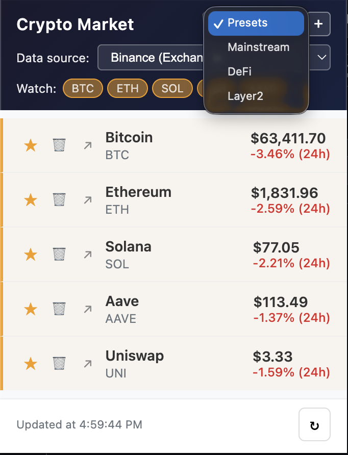
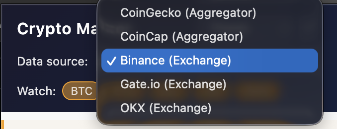
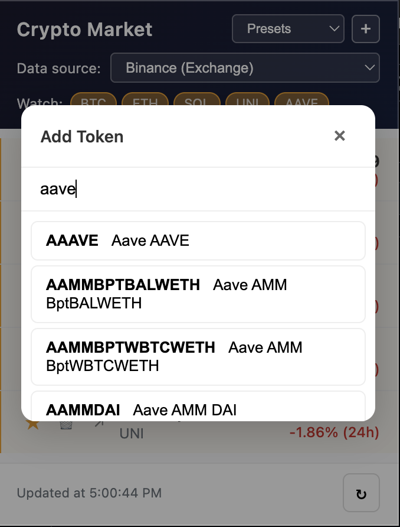

# 加密货币价格跟踪

适用于 Edge 和 Chrome 的浏览器扩展，用于跟踪主流加密货币价格与 24 小时涨跌幅，支持多数据源和自定义关注列表。

## 界面预览

### 主弹窗 – 价格列表与关注

### 数据源切换

### 添加 Token – 搜索并添加币种

## 功能

### 图标 Badge（未打开弹窗时）

- 在扩展图标上显示比特币价格（如 `63.2k`）
- 按 24 小时涨跌幅着色：**涨** 为绿色，**跌** 为红色
- 每 60 秒自动更新

### 弹窗

- **价格列表**：币种名称、代号、当前 USD 价格、24h 涨跌幅（带颜色）
- **关注列表**：通过 ★/☆ 或顶部标签将币种置顶显示
- **多数据源**：CoinGecko、CoinCap、Binance、Gate.io、OKX，可切换以应对限流（如 429）
- **搜索添加**：输入代号或名称（如 `uni`）搜索并添加，支持 5000+ 币种
- **预设列表**：主流、DeFi、Layer2，一键加载常用组合
- **增删管理**：通过搜索添加，通过每行垃圾桶图标删除
- **外部链接**：可跳转至 CoinGecko 查看详情

### 多语言

- 自动跟随浏览器语言（默认英文）
- 支持英文和简体中文

## 安装

1. 打开 **Edge**（`edge://extensions/`）或 **Chrome**（`chrome://extensions/`）
2. 开启 **开发人员模式**
3. 点击 **加载解压缩的扩展**
4. 选择本扩展所在目录

## 技术

- Manifest V3
- 免费公开 API：CoinGecko、CoinCap、Binance、Gate.io、OKX（无需 API Key）
- 纯 HTML/CSS/JS，无构建工具

## 使用提示

- 出现「API 429」或加载失败时，可切换其他数据源
- 未打开弹窗时，图标颜色表示 BTC 的 24h 涨跌
- 搜索建议输入代号（如 `uni`、`pepe`）或名称（如 `Uniswap`）
